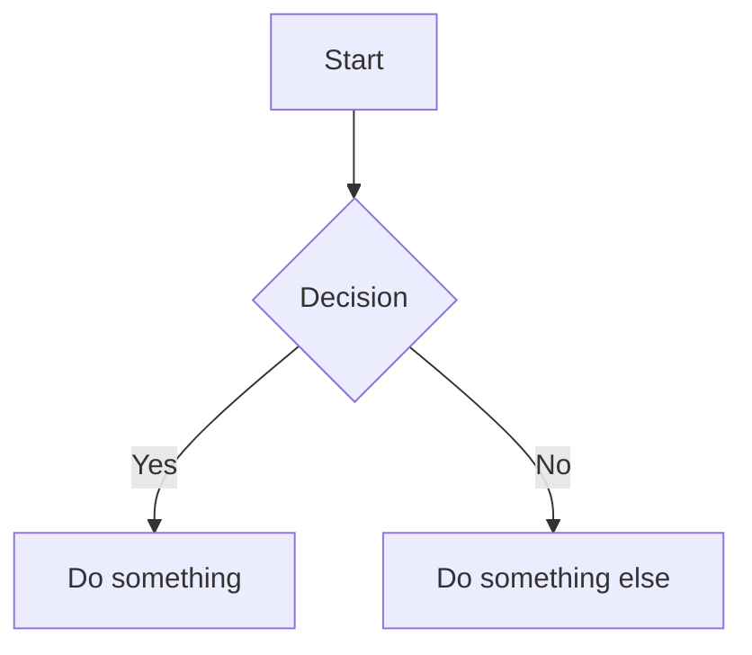

# Welcome to diffpssi docs

This is a small starter page demonstrating:

- A Google-style docstring rendered by mkdocstrings (see API/reference pages)
- LaTeX math (KaTeX) in Markdown
- Mermaid diagrams

## LaTeX example
Inline math: $E = mc^2$

Display math:

$$
\frac{\mathrm{d}x}{\mathrm{d}t} = Ax + Bu
$$

## Mermaid example

## Quick usage
See `requirements.md` for installation instructions and how to run the local dev server.
